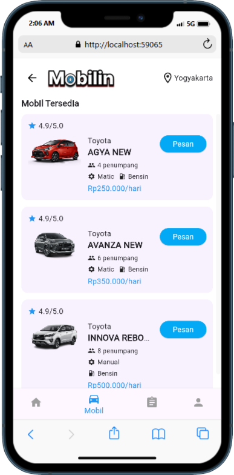

# 📱 Mobilin – Aplikasi Rental Mobil

**Mobilin** adalah aplikasi mobile berbasis Flutter yang dirancang untuk mempermudah proses penyewaan mobil, khususnya di wilayah Yogyakarta. Aplikasi ini hadir sebagai solusi bagi pengguna yang khawatir akan penipuan saat menyewa mobil secara online.

---

## 🚗 Fitur Utama

- 🔐 Autentikasi pengguna (Firebase Auth)
- 📄 Formulir penyewaan mobil
- 📍 Pilihan titik pengambilan mobil
- 💸 Estimasi harga sewa

---

## ⚙️ Teknologi yang Digunakan

| Layer         | Tools/Framework                |
|---------------|-------------------------------|
| Front-End     | Flutter                        |
| Back-End      | Firebase (Auth, Firestore)     |
| Design        | Figma                          |
| Versi Android | minSdkVersion 21+              |

---

## 🛠️ Cara Menjalankan Proyek

1. Clone repo:

```bash
git clone https://github.com/nzlf/mobilinproject.git
cd mobilinproject
```

2. Jalankan Flutter pub:

```bash
flutter pub get
```

3. Tambahkan file konfigurasi Firebase:
   - `android/app/google-services.json`
   - `lib/firebase_options.dart`

4. Jalankan di emulator atau device:

```bash
flutter run
```

---

## 👨‍💻 Anggota Tim

- **Jaki** – Front-End Developer
- **Zala** – Back-End Developer
- **Opet** – UI/UX Designer

---

## 📷 Tampilan Aplikasi



---

## 📄 Lisensi

Proyek ini dibuat untuk keperluan pembelajaran dalam mata kuliah **Teknologi Mobile – Universitas Ahmad Dahlan**.